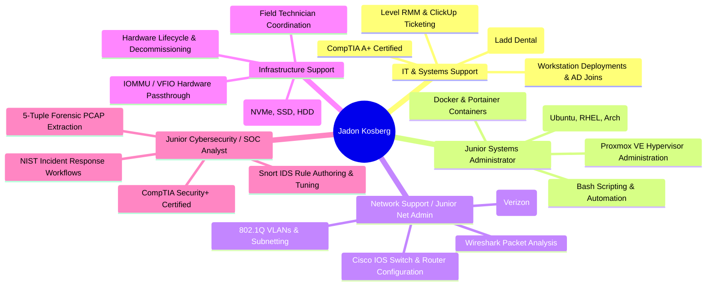

# Target Role Competency Alignment

This section provides a clear mapping for recruiters and hiring managers demonstrating how my production IT experience, industry certifications, formal education, and hands-on technical labs align with five primary IT career pathways.

---

---

## Detailed Competency Cross-Walk

=== "IT Support & Systems Support"

    ### **Primary Fit: IT Support Technician / Systems Support Specialist**
    
    * **Real-World Experience:**
        * Managed 20+ weekly support tickets across 12 medical/dental clinics supporting 100+ clinical and administrative staff ([Ladd Dental Group](../experience/ladd-dental.md)).
        * Utilized **Level RMM** for remote diagnostics and **ClickUp** for structured ticket lifecycle tracking.
        * Staged, domain-joined (Active Directory), and deployed 30+ Windows workstations.
        * Executed retail technology conversion procedures under strict maintenance SLAs ([Verizon / Vaco](../experience/verizon-conversions.md)).
    * **Certifications & Education:**
        * **CompTIA A+ (Earned May 2026)**
        * **B.S. in Informatics** (Indiana University Kokomo, 2022)
    * **Technical Skills:** Windows 10/11, Active Directory users/groups, Microsoft 365, static IP printer setup, peripheral diagnostics, customer service communication.

=== "Junior Systems Administrator"

    ### **Primary Fit: Junior Sysadmin / Systems Administrator**
    
    * **Real-World Experience:**
        * Windows endpoint configuration, domain joining, Active Directory permission auditing, and system imaging.
    * **Technical Labs & Infrastructure:**
        * Administering a bare-metal **Proxmox VE 9.1** hypervisor hosting a 10-VM multi-distribution environment ([Proxmox Case Study](../technical-labs/proxmox-virtualization.md)).
        * Managing microservices using **Docker Engine** and **Portainer** on Ubuntu Server.
        * Deploying multi-tier application stacks on **AWS EC2 Linux** ([AWS Case Study](../technical-labs/aws-linux-infrastructure.md)).
        * Writing modular **Bash automation scripts** with error trapping (`set -euo pipefail`) for system maintenance.
    * **Certifications & Education:**
        * **CompTIA Security+** & **CompTIA A+**
        * Ivy Tech Technical Certificate in Cyber Security (Coursework in Linux & Virtualization Technologies).

=== "Network Support / Junior Network Admin"

    ### **Primary Fit: Network Support Specialist / Junior Network Administrator**
    
    * **Real-World Experience:**
        * Static IPv4 configuration, enterprise network printer deployment, firewall port patching, and link verification across distributed store locations ([Verizon Conversions](../experience/verizon-conversions.md)).
    * **Technical Labs & Infrastructure:**
        * Configuring Cisco Catalyst switches and ISR routers: 802.1Q trunking, VLAN segmentation, router-on-a-stick, and access control lists ([Cisco Case Study](../technical-labs/cisco-networking-analysis.md)).
        * Performing deep packet inspection and transport-layer troubleshooting using **Wireshark** and **tcpdump** (TCP 3-way handshakes, sequence/ACK tracking, windowing, SLAAC vs DHCPv6).
        * Configuring Software-Defined Networking (SDN) zones with managed dynamic IPAM in Proxmox.
    * **Certifications & Education:**
        * **Cisco Networking Academy:** CCNA Introduction to Networks & Networking Basics.

=== "Infrastructure Support"

    ### **Primary Fit: Infrastructure Support / Data Center Support**
    
    * **Real-World Experience:**
        * Physical hardware installation, structured cabling management, and hardware lifecycle management.
        * Managed the secure decommissioning of 50+ retired workstations with documented chain of custody.
    * **Technical Labs & Infrastructure:**
        * Managing physical server compute, multi-tiered storage pools (`local`, `local-lvm`, `vmdata`), and thermal/memory capacity planning.
        * Configuring Linux kernel parameters and **VFIO / IOMMU** hardware isolation for GPU passthrough.
    * **Certifications & Education:**
        * **CompTIA A+** & **CompTIA Security+**

=== "Junior Cybersecurity / SOC Analyst"

    ### **Primary Fit: Junior SOC Analyst / Information Security Specialist**
    
    * **Real-World Experience:**
        * Hardware decommissioning following organizational security procedures with documented chain of custody.
        * Enforcing principle of least privilege in user and endpoint provisioning.
    * **Technical Labs & Infrastructure:**
        * Authoring custom **Snort IDS rules**, tuning detection thresholds, and analyzing security alerts ([SOC Case Study](../technical-labs/soc-threat-detection.md)).
        * Conducting 5-tuple forensic correlation, PCAP stream reassembly, and malicious payload extraction.
        * Applying datacenter-level firewall access control lists (ACLs) to enforce network segmentation.
    * **Certifications & Education:**
        * **CompTIA Security+ (SY0-701, Earned May 2026)**
        * Technical Certificate in Cyber Security & Information Assurance (Cisco CyberOps Associate track).
