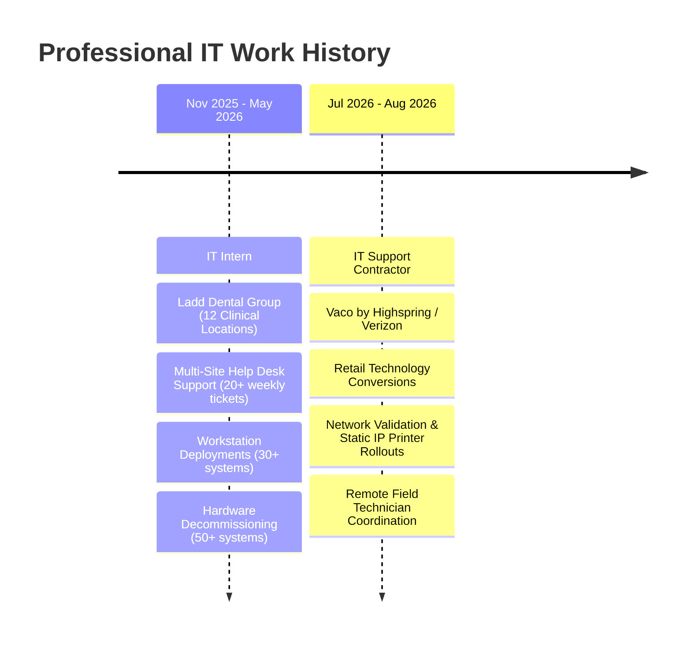

# Professional IT Experience

This section provides an overview of my professional employment history in IT support, systems administration, and field technology rollouts.

---

## Experience Summary

---

## Detailed Roles

### 1. **IT Support Contractor** — *Vaco by Highspring / Verizon*
**Location:** Fishers, IN / Multi-Site Retail Locations  
**Duration:** July 2026 – August 2026  
**Primary Focus:** Retail Network Conversions, Static IP Configuration, Firewall Port Connectivity Validation

* Supported end-to-end technology conversion windows across distributed Verizon retail store locations, ensuring zero disruption to store opening hours.
* Configured and deployed network printers, assigning static IPv4 parameters, default gateways, and verifying print queue functionality.
* Patched endpoint devices to firewall switchports and validated local subnet and cloud egress access.
* Partnered remotely with field engineers to execute live migration steps and provided post-conversion checkout and troubleshooting support.

[:material-file-document-outline: View Complete Verizon Case Study](verizon-conversions.md){ .md-button }

---

### 2. **IT Intern** — *Ladd Dental Group*
**Location:** Kokomo, IN (12 Regional Healthcare Practices)  
**Duration:** November 2025 – May 2026  
**Primary Focus:** Distributed Endpoint Support, Level RMM Fleet Management, Workstation Deployments, Hardware Decommissioning

* Resolved 20+ weekly support requests across 12 distributed dental practices supporting 100+ clinical and administrative staff members.
* Managed tickets, troubleshooting notes, and resolution documentation within **ClickUp**.
* Utilized **Level RMM** for remote monitoring, diagnostic execution, and remote desktop support across endpoints.
* Built, configured, domain-joined (Active Directory), and deployed 30+ new Windows workstations.
* Decommissioned 50+ end-of-life workstations following organizational security procedures with documented chain of custody.

[:material-file-document-outline: View Complete Ladd Dental Case Study](ladd-dental.md){ .md-button }

---

## Operational Toolset

| Category | Tools & Technologies Used in Production |
| :--- | :--- |
| **Operating Systems** | Windows 10, Windows 11, Windows Server (Active Directory Domain Services) |
| **Remote Management & RMM** | Level RMM, Remote Desktop Protocol (RDP), Quick Assist |
| **Ticketing & Documentation** | ClickUp, structured resolution logging, change-window checklists |
| **Networking & Peripherals** | Static IPv4 configuration, enterprise network printers, firewall port patching, cable testing, Wi-Fi validation |
| **Identity & Access** | Active Directory user/group management, domain joining, credential resets |
