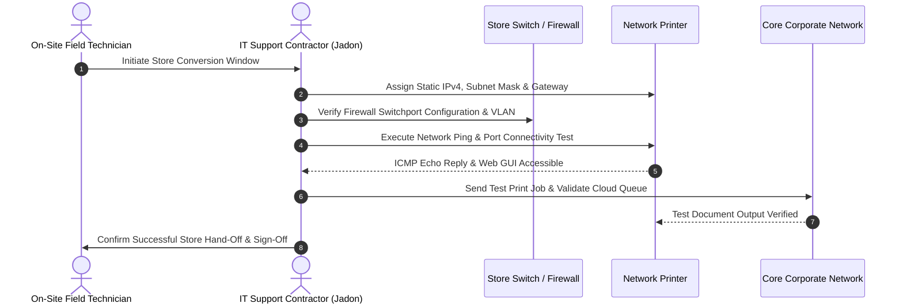

# Case Study: Enterprise Retail Technology Conversions

**Organization:** Vaco by Highspring / Verizon  
**Role:** IT Support Contractor  
**Location:** Fishers, IN / Multi-Site Retail Locations  
**Duration:** July 2026 – August 2026  
**Scope:** Distributed Retail Store Conversions & Network Validation  

---

## Project Overview

During nationwide retail technology upgrades, Verizon store locations underwent structured hardware and network conversions to modernize point-of-sale (POS) and back-office infrastructure. As an IT Support Contractor, I was responsible for validating network connectivity, executing static IP printer deployments, patching devices to firewall ports, and coordinating remotely with field technicians during tight conversion maintenance windows.

---

## Core Responsibilities & Technical Execution

### 1. Network Printer Configuration & Static Addressing
* Configured enterprise network printers for retail floor and back-office use.
* Assigned dedicated static IPv4 addresses, subnet masks, default gateways, and internal DNS server addresses according to site network plans.
* Validated that print spooler services and point-of-sale endpoints communicated reliably across the local subnet.

### 2. Firewall Port Patching & Connectivity Verification
* Connected migrated endpoints to designated firewall switchports.
* Verified link speed, duplex negotiation, and LED indicator status on network hardware.
* Conducted connectivity verification tests (ICMP reachability, gateway response, and cloud service egress) to ensure the retail location met production readiness criteria.

### 3. Remote Technician Coordination & SLA Adherence
* Collaborated via real-time communication channels with on-site field technicians, remote network engineers, and project managers.
* Followed standardized change-window runbooks to execute cutover steps in precise sequential order.
* Conducted post-migration verification with store staff to confirm receipt of test print jobs and POS receipt generation prior to store opening.

---

## Production Relevance

* **Change Management Discipline:** Executing precise technical runbooks during time-sensitive retail maintenance windows.
* **Network Layer 1–3 Troubleshooting:** Isolating link-layer patching issues, IP address conflicts, and default gateway misconfigurations.
* **Cross-Functional Collaboration:** Communicating technical status clearly between remote engineers and non-technical retail staff.
