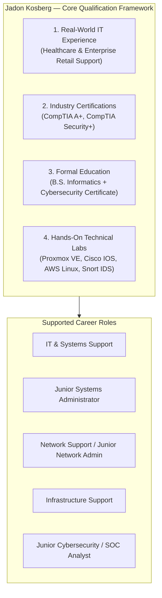

# Jadon Kosberg

**IT Infrastructure | Networking | Cybersecurity**

Kokomo, IN • [jadonkosberg@gmail.com](mailto:jadonkosberg@gmail.com) • [LinkedIn](https://linkedin.com/in/jadon-kosberg) • [GitHub](https://github.com/jkosber)

---

### Professional Overview

I am an entry-level IT professional with hands-on, multi-site support experience across distributed healthcare and enterprise retail environments. I hold active **CompTIA Security+** and **CompTIA A+** certifications, a **B.S. in Informatics**, and a **Technical Certificate in Cyber Security & Information Assurance**. 

My background bridges day-to-day IT operational support—such as endpoint provisioning, Active Directory management, RMM administration, and network validation—with deep technical practice in **Proxmox virtualization**, **software-defined networking (SDN)**, **Cisco switch/router configuration**, **packet analysis**, and **Linux administration**.

---

## The Four Qualification Pillars

-   :material-briefcase-check:{ .lg .middle } **1. Production IT Experience**

    ---

    Proven field and remote support history across **12 healthcare practices** and **enterprise retail conversions**. Experience with Level RMM, ClickUp, Active Directory, static IP network printer deployment, and hardware lifecycle management.

    [:octicons-arrow-right-24: View Work History](experience/index.md)

-   :material-certificate:{ .lg .middle } **2. Industry Certifications**

    ---

    - **CompTIA Security+** *(Earned May 2026)*
    - **CompTIA A+** *(Earned May 2026)*
    - **Cisco Networking Academy** *(Networking Basics & Introduction to Networks)*

    [:octicons-arrow-right-24: View Certifications](credentials/index.md)

-   :material-school:{ .lg .middle } **3. Formal Education**

    ---

    - **B.S. in Informatics** — Indiana University Kokomo (2022)
    - **Technical Certificate in Cyber Security** — Ivy Tech Community College (May 2026)
    - *Dean's List Honors (2020, 2021, 2025)*

    [:octicons-arrow-right-24: View Academic Record](credentials/index.md)

-   :material-server-network:{ .lg .middle } **4. Hands-On Technical Labs**

    ---

    Continuous self-hosted and lab-scale infrastructure demonstrating engineering depth: **Proxmox VE 9.1 SDN**, **Cisco IOS CLI & Wireshark forensics**, **AWS multi-tier Linux**, and **Snort IDS rules**.

    [:octicons-arrow-right-24: Explore Technical Labs](technical-labs/index.md)

---

## Professional Experience Spotlight

### **IT Support Contractor** — *Vaco by Highspring / Verizon*
`Jul 2026 – Aug 2026` • *Fishers, IN / Multi-Site Retail*

* Supported retail technology conversion rollouts across distributed store locations under strict change-window timelines.
* Configured and deployed enterprise network printers, assigning static IPv4 configurations and testing print queues.
* Connected endpoint devices to designated firewall switchports and validated network access and egress.
* Partnered remotely with field engineers during live migrations to resolve connectivity issues and conduct post-conversion user acceptance testing.

[:material-file-document-outline: Read the Verizon Conversions Case Study](experience/verizon-conversions.md){ .md-button }

---

### **IT Intern** — *Ladd Dental Group*
`Nov 2025 – May 2026` • *Kokomo, IN / Distributed Healthcare (12 Locations)*

* Resolved 20+ weekly help desk tickets across 12 dental practices supporting 100+ clinical and administrative staff.
* Provided remote triage and endpoint management using **Level RMM** and maintained structured ticket documentation in **ClickUp**.
* Staged, configured, and deployed 30+ new Windows workstations, including base imaging, domain joining (Active Directory), and peripheral setups.
* Decommissioned 50+ retired systems following organizational security procedures with documented chain of custody.

[:material-file-document-outline: Read the Ladd Dental Group Case Study](experience/ladd-dental.md){ .md-button }

---

## Target Role Competency Matrix

This portfolio is structured to demonstrate relevant competencies across five primary career pathways:

| Target Role Family | Key Evidence & Experience | Supporting Labs & Certs |
| :--- | :--- | :--- |
| **IT Support / Systems Support** | Multi-site healthcare & retail support, Level RMM, M365, Active Directory, hardware provisioning, ticketing SLA management. | CompTIA A+, CompTIA Security+, Workstation deployment workflows. |
| **Junior Systems Administrator** | Windows 10/11 fleet management, user provisioning, Linux administration, Bash automation, service management (`systemd`). | Proxmox VE 9.1 hypervisor, Docker container management, AWS EC2 Linux multi-tier stack. |
| **Network Support / Junior Network Admin** | Static IP allocation, switchport patching, firewall connectivity verification, structured cabling triage. | Cisco Networking Academy coursework, Cisco IOS CLI (VLANs, routing, ACLs), Wireshark packet capture. |
| **Infrastructure Support** | Hardware lifecycle management, multi-tier storage, remote field engineer coordination, device decommissioning. | Bare-metal Proxmox administration, KVM/QEMU, IOMMU GPU passthrough (`vfio-pci`). |
| **Junior Cybersecurity / SOC Analyst** | Principle of least privilege, organizational data protection procedures, Security+ concepts. | CompTIA Security+, Snort IDS rule creation, 5-tuple forensic isolation, malware PCAP packet dissection. |

[:octicons-arrow-right-24: View Full Career Role Breakdown](career-paths/index.md){ .md-button .md-button--primary }

---

## Selected Technical Lab Highlights

> *Note: Technical labs represent hands-on engineering environments built to explore infrastructure, networking, and security concepts beyond daily operational support duties.*

-   **Proxmox VE & SDN Virtualization**
    
    ---
    
    Bare-metal Proxmox hypervisor hosting a 10-VM multi-distro range with Software-Defined Networking (SDN) zone isolation, managed dynamic IPAM, and datacenter firewall ACLs.
    
    [:octicons-link-external: Case Study](technical-labs/proxmox-virtualization.md) • [:octicons-mark-github: Repository](https://github.com/jkosber/JHomelab)

-   **Cisco Switching, Routing & Packet Forensics**
    
    ---
    
    Cisco IOS switch and router configuration (VLANs, 802.1Q trunking, inter-VLAN routing, IPv4/IPv6 dual-stack) paired with deep-dive Wireshark/tcpdump protocol analysis.
    
    [:octicons-link-external: Case Study](technical-labs/cisco-networking-analysis.md) • [:octicons-mark-github: Repository](https://github.com/jkosber/CSIA-210-Network-Protocol-Analysis)

-   **AWS Multi-Tier Linux Deployment**
    
    ---
    
    Multi-tier AdventureWorks database and web server infrastructure on AWS EC2 Linux, incorporating Bash automation scripts, permission hardening, and service management.
    
    [:octicons-link-external: Case Study](technical-labs/aws-linux-infrastructure.md) • [:octicons-mark-github: Repository](https://github.com/jkosber/SVAD-111-Linux-Virtualization)

-   **SOC Operations & Snort IDS Threat Detection**
    
    ---
    
    Cisco CyberOps Associate security workflows: custom Snort IDS signature authoring, 5-tuple incident triage, PCAP executable extraction, and log correlation.
    
    [:octicons-link-external: Case Study](technical-labs/soc-threat-detection.md) • [:octicons-mark-github: Repository](https://github.com/jkosber/CyberOps-115)

---

## Connect & Verify

* **Email:** [jadonkosberg@gmail.com](mailto:jadonkosberg@gmail.com)
* **LinkedIn:** [linkedin.com/in/jadon-kosberg](https://linkedin.com/in/jadon-kosberg)
* **GitHub:** [github.com/jkosber](https://github.com/jkosber)
