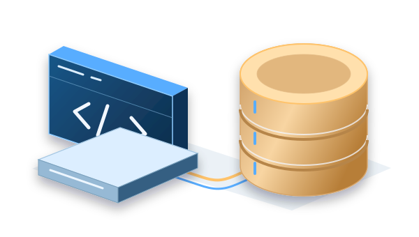

# AdventureWorks on AWS

I completed AdventureWorks for **SVAD 111: Linux & Virtualization Technologies**. The assignment covered a two-tier application on AWS, with a Linux web server connected to a separate database server.

## Assignment

The project used AWS EC2, Ubuntu, Apache, PHP and Microsoft SQL Server. Course milestones covered provisioning the instances, configuring the database and web servers, and preparing the final report.

<figure class="case-visual">
  
  <figcaption>Simplified view of the coursework application's two tiers.</figcaption>
</figure>

## Project record

| Stage | Source material |
|---|---|
| Initial infrastructure | [Module 3 milestone documents](https://github.com/jkosber/SVAD-111-Linux-Virtualization/tree/main/Module03) |
| Database setup | [Module 5 milestone documents](https://github.com/jkosber/SVAD-111-Linux-Virtualization/tree/main/Module05) |
| Web tier and final milestones | [Module 7 submissions](https://github.com/jkosber/SVAD-111-Linux-Virtualization/tree/main/Module07) |
| Final report | [AdventureWorks Project — Jadon Kosberg](https://github.com/jkosber/SVAD-111-Linux-Virtualization/blob/main/AdventureWorks%20Project%20-%20Jadon%20Kosberg.docx) |
| Related scripting exercises | [VM_Share Bash files](https://github.com/jkosber/SVAD-111-Linux-Virtualization/tree/main/VM_Share) |

## Status

The assignment is complete. The repository contains the submitted report, milestone documents and related Bash scripts.

The [ongoing Proxmox homelab](proxmox-virtualization.md) is a separate personal project.

[Course repository](https://github.com/jkosber/SVAD-111-Linux-Virtualization) · [All projects](index.md)
