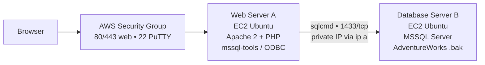

# AWS Multi-Tier Linux Infrastructure

**Primary Focus:** Cloud Virtualization, Multi-Tier Architecture, Linux Administration, MSSQL on Linux, Apache/PHP  
**Source Repository:** [github.com/jkosber/SVAD-111-Linux-Virtualization](https://github.com/jkosber/SVAD-111-Linux-Virtualization)

---

## 1. Objective

Host AdventureWorks — a 35-year mail-catalog bike shop moving catalog operations online — as a two-tier web → DB stack on AWS with reproducible build notes.

Built as the SVAD-111 capstone: separate web and database tiers so each can be patched and rebuilt independently. Final record is `AdventureWorks Project - Jadon Kosberg.docx` (TOC + Executive Summary + Business Scenario).

---

## 2. Cloud Architecture

- **Web Server A** — EC2 Ubuntu, Apache + PHP + `mssql-tools`/`php-sybase` + ODBC. Reached via public IP; SG opens `80/443` (lab) and `22` for PuTTY.
- **Database Server B** — EC2 Ubuntu, MSSQL Server, AdventureWorks sample `.bak` restored via `sqlcmd`. Private IP discovered with `ip a` (same pattern as `VM_Share/m05p2b/ex1.sh`) and used in `config.php` as `<DB_B_private_IP>,1433`.
- **Security group** — updated in Milestone 3A to allow `80/443`. DB `1433/tcp` is internal between tiers. Least-privilege narrowing (Web SG → DB `1433`, `22` from mgmt only) is a planned hardening step.

Source: `M03 Milestone1` (Web A + DB B), `M05 Milestone2A/B` (MSSQL + restore), `M07 Milestone3A/B/C` (web tier + app deploy). Repo holds the milestone `.docx` docs as the record.

---

## 3. Implementation

| Milestone    | What                   | Key steps / evidence                                                                                                                     |
| ------------ | ---------------------- | ---------------------------------------------------------------------------------------------------------------------------------------- |
| **M03 — M1** | Launch Web A + DB B    | EC2 Ubuntu, key pair, SG — `EC2 Instances Screenshot` shows both `running`                                                               |
| **M05 — 2A** | MSSQL on DB B          | `curl` GPG keys → `add-apt-repository` → `apt install mssql-server` → `systemctl start mssql-server`                                     |
| **M05 — 2B** | Restore AdventureWorks | `scp` `.bak` → extract → restore → `sqlcmd -S <DB_B_IP>,1433 -U sa -Q "SELECT name FROM sys.databases"` — expect `AdventureWorks` listed |
| **M07 — 3A** | Prep web tier          | SG update `80/443` → `apt install mssql-tools apache2 php php-sybase`                                                                    |
| **M07 — 3B** | Patch + ODBC           | `apt update && apt upgrade` → `sqlcmd` path + ODBC driver                                                                                |
| **M07 — 3C** | Deploy PHP app         | `scp`/`unzip` app → `/var/www/html` → `config.php` DB string `<DB_B_private_IP>,1433` → browser test shows product data from DB          |
| **M07 — 4**  | Documentation          | Assemble `AdventureWorks Project - Jadon Kosberg.docx` (TOC / Executive Summary / build steps)                                           |

Scripts referenced mirror lab patterns: `ex1.sh` (`hostname`/`date`/`free -h`/`df -h`/`ip a`) for `ip a` discovery, `dl_wallpaper.sh` (`curl -Is` 200 check + `clamscan` before use) for safe fetches.

No `docker-compose.yml` / `cloudformation.yml` in repo — docx are the lab record; containerized port to JHomelab `testnet` is planned.

---

## 4. Validation

- **M03** console screenshot — Web A + DB B `running`.
- **M05 2B** `sqlcmd -S <DB_B_IP>,1433 -U sa -Q "SELECT name FROM sys.databases"` → `AdventureWorks` present.
- **M07 3C** `curl -I http://<Web_A_IP>` → `200` + PHP renders AdventureWorks product listings from DB B.
- `M07 3C` app files show review data queried from DB B.

Out of scope: load testing, TLS probe, cost/perf tuning.

---

## 5. Troubleshooting & Lessons

??? example "Web tier cannot reach DB" * **Symptom:** PHP app `500` on DB query. * **Checks:** `systemctl status apache2` + `/var/log/apache2/error.log`, `ip a` on DB B to confirm private IP, `sqlcmd -S <DB_B_private_IP>,1433 -U sa` from Web A, SG ingress for `1433/tcp` between tiers. * **Fix:** Ensure `config.php` uses DB B private IP (not public) with `,1433`, and SG allows Web A → DB B on `1433/tcp`.

**Lessons:** `GPG → repo → apt → systemctl` chain matches PVE update flow; private IP via `ip a` is the correct DB string; screenshots are the lab's validation artifact until replaced by `curl`/`sqlcmd` probes in a future `check.sh` (see `04-Projects/AdventureWorks-AWS-MultiTier` in vault).

---

## 6. Production & Enterprise Relevance

- **Tier isolation** — separating web and DB lets each be patched/rebuilt independently; maps to an on-prem port on JHomelab `testnet` (e.g., two VMs on `10.10.100.0/24`).
- **Hardening path** — lab SG is world-open on `80/443`; production would narrow DB `1433` to Web SG only and add TLS via reverse proxy (as planned on JHomelab VM 109 Nginx Proxy Manager `:81`).

---

_Docs: `SVAD-111-Linux-Virtualization` M03/M05/M07 milestone docx + `AdventureWorks Project - Jadon Kosberg.docx` — see repo for per-assignment Word docs and `VM_Share` scripts._
