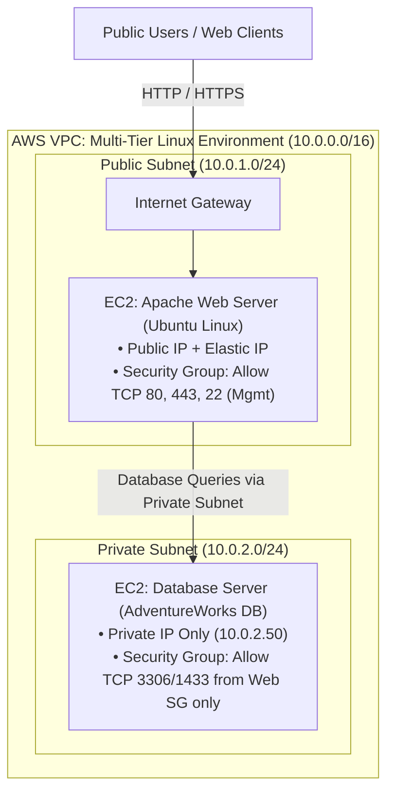

# AWS Multi-Tier Linux Infrastructure

**Primary Focus:** Cloud Virtualization, Multi-Tier Architecture, Linux Administration, Bash Automation, Service Hardening  
**Source Repository:** [github.com/jkosber/SVAD-111-Linux-Virtualization](https://github.com/jkosber/SVAD-111-Linux-Virtualization)  

---

## 1. Objective

To design and deploy an enterprise-pattern multi-tier application environment on **Amazon Web Services (AWS)** using Linux EC2 instances, separating the public-facing Apache Web Server tier from the internal Database tier, while implementing automated system maintenance via Bash scripting.

---

## 2. Cloud Architecture



---

## 3. Implementation Highlights

### A. Linux System Administration & User Security
* **User & Group RBAC:** Established distinct administrative groups (`wheel`/`sudo`) and service accounts with restricted shell privileges (`/sbin/nologin`).
* **Filesystem Permissions & Umask:** Configured standard directory permissions (`755`) and secure database file permissions (`600` / `640`) to enforce least privilege.
* **Service Lifecycle Management:** Managed service states, daemon reloads, and autostart configurations using `systemctl` (`systemctl enable --now apache2`).

### B. Automated Shell Scripting (`Bash`)
Automated routine administrative workflows and file handling using modular Bash scripts:

```bash
#!/bin/bash
# ==============================================================================
# Automated Log Rotation & Archival Script
# ==============================================================================
set -euo pipefail

LOG_DIR="/var/log/adventureworks"
ARCHIVE_DIR="/var/backups/adventureworks"
TIMESTAMP=$(date +"%Y%m%d_%H%M%S")

mkdir -p "${ARCHIVE_DIR}"

if [ -d "${LOG_DIR}" ]; then
    echo "[INFO] Archiving logs from ${LOG_DIR} at ${TIMESTAMP}..."
    tar -czf "${ARCHIVE_DIR}/app_logs_${TIMESTAMP}.tar.gz" -C "${LOG_DIR}" .
    find "${ARCHIVE_DIR}" -type f -name "app_logs_*.tar.gz" -mtime +30 -delete
    echo "[SUCCESS] Archive completed and logs older than 30 days purged."
else
    echo "[ERROR] Log directory ${LOG_DIR} does not exist." >&2
    exit 1
fi
```

---

## 4. Troubleshooting & Validation

??? example "Issue: Web Tier Inability to Establish DB Connection"
    * **Problem:** The web front-end returned `500 Internal Server Error` during database query initialization.
    * **Troubleshooting:**
      1. Verified local Apache service status and error logs (`/var/log/apache2/error.log`).
      2. Tested port reachability from the web instance to the database instance using `nc -zv 10.0.2.50 3306`.
      3. Discovered that the AWS Database Security Group was missing an ingress rule allowing traffic from the Web Server Security Group ID.
    * **Resolution:** Added a security group rule allowing TCP 3306 with the Web Security Group as the source, instantly resolving database connectivity without exposing the database to the public internet.

---

## 5. Production & Enterprise Relevance

* **Cloud Tiering & Defense-in-Depth:** Isolating database backends into private subnets ensures that even if a public web tier is compromised, the data layer cannot be accessed directly from the public internet.
* **Operational Automation:** Demonstrates the ability to write reliable, self-documenting shell scripts with strict error handling (`set -euo pipefail`).
