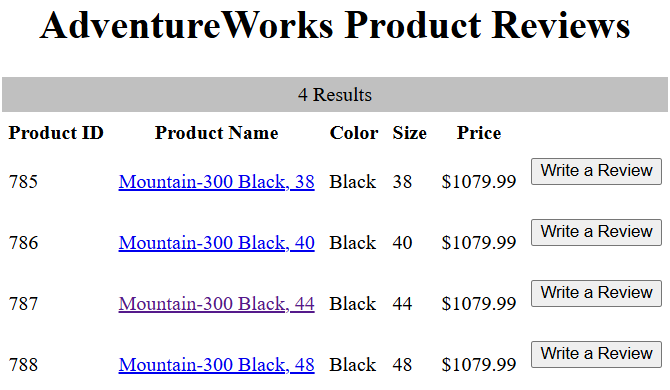

# AdventureWorks on AWS

I deployed a course-provided product-review application on two Ubuntu servers in AWS: Apache and PHP served the website, while Microsoft SQL Server held the AdventureWorks catalog and reviews. The completed demonstration could search products, display a product page and accept a review.

My contribution in **SVAD 111: Linux & Virtualization Technologies** was provisioning, installation, configuration, troubleshooting and testing. The course supplied the application, dataset, two-tier design and milestone instructions. This was a school deployment, not work for an actual AdventureWorks business.

<div class="evidence-note" markdown>
**Historical result:** final report dated May 8, 2026, with milestone submissions and screenshots. These are the recorded coursework results; the deployment has not been retested for this page.
</div>

## Architecture and connection paths

<figure class="architecture">
  <ol class="architecture-flow">
    <li><strong>Browser</strong><span>Search catalog, open product, submit review</span><small>HTTP · TCP 80</small></li>
    <li><strong>Web instance</strong><span>Ubuntu 22.04<br>Apache + PHP 8.1<br>SQL Server PHP drivers</span><small>SQL connection · TCP 1433</small></li>
    <li><strong>Database instance</strong><span>Ubuntu 22.04<br>Microsoft SQL Server<br>AdventureWorks database</span><small>Catalog and review storage</small></li>
  </ol>
  <figcaption>Historical coursework architecture. PuTTY and WinSCP provided separate administrative connections over SSH to each instance. Role labels replace the original instance addresses.</figcaption>
</figure>

The browser contacted the web instance. PHP then connected to the database instance using its internal address in `config.php`; the browser did not query SQL Server directly. Keeping the tiers separate made the network rule, database login and PHP driver configuration part of the application's working path.

The recorded security-group rules allowed broader access than these application paths required; the security limits are described below.

## Server setup

The final report shows two EC2 instances and describes Ubuntu 22.04 on both. I used PuTTY for shell access and WinSCP to transfer the supplied archives. The database setup used Microsoft's SQL Server repository, the SQL Server service and the `sqlcmd` client. The web setup added Apache, PHP and the Microsoft ODBC/PHP components.

I checked the dependencies in stages: SQL queries confirmed imported data, `test.php` confirmed PHP execution, and the application pages exercised the connection between the two servers.

## Database and application configuration

### Adapting the data import for Linux

The supplied `adventureworks-db.tar.gz` contained a Windows-oriented SQL import script and data files. Milestone 2B prescribed converting the script from UTF-16 to UTF-8, setting its data directory, removing `CODEPAGE` lines and matching the row terminator to the files' CRLF endings. These were compatibility steps for the provided dataset, not a schema I designed.

Selected commands from that milestone's workflow:

```bash
iconv -f UTF-16 -t UTF-8 instawdb.sql.orig > instawdb.sql
sed -i -e /CODEPAGE/d instawdb.sql
sed -i -e 's/\\n/\\r\\n/' instawdb.sql
```

The encoding conversion made the script usable by the text-processing commands. The row-terminator change aligned the bulk-import statements with the supplied CSV files. The instructions also set `SqlSamplesSourceDataPath` to the extracted data directory, including its trailing slash. The submitted screenshot shows the completed import and subsequent queries; the preparation commands above come from the milestone instructions.

I checked two tables through `sqlcmd`:

```sql
SELECT COUNT(*) FROM Production.Product;
GO
SELECT COUNT(*) FROM Person.Person;
GO
```

The queries returned **504 products** and **19,972 people**, confirming that both expected tables contained imported data.

### Connecting PHP to SQL Server

Milestone 3B specified PHP 8.1 with the `sqlsrv` and `pdo_sqlsrv` extensions, enabled through `phpenmod`. It also configured Apache's prefork module and PHP module. The submitted `test.php` screenshot shows PHP 8.1.2 running through the Apache handler. That established PHP execution before adding the application's database dependency.

I transferred the supplied application archive, placed the PHP files in `/var/www/html`, and set the database address and login information in `config.php`. The milestone removed Apache's default `index.html` so it would no longer take precedence over the application entry page. Credentials and original host addresses are omitted here.

The catalog and review pages then exercised more of the system than `test.php`: Apache served the request, PHP ran the supplied code, and the application reached the database.

## Troubleshooting

The final report records these problems and responses. Its successful end-state screenshots support overall recovery, but it does not include before-and-after captures or configuration diffs for each fix.

<div class="narrative-list" markdown>

Web-to-database connection timed out
: **Investigation and change.** The report attributes the failure to the EC2 security group and records adding access for SQL Server on TCP 1433.
: **Verification.** Later catalog and review pages demonstrate application/database communication. The exact failing rule and a dedicated connection retest are not preserved.

Microsoft packages could not be found
: **Investigation and change.** Added the Microsoft signing key and repository source, then continued installation.
: **Verification.** The submissions show SQL queries and PHP working later. No full failed package-manager log is preserved.

Initial PuTTY connection could not reach EC2
: **Investigation and change.** The report identifies blocked outbound SSH on the access network and records switching to a hotspot.
: **Verification.** Subsequent shell screenshots show access. This documents the reported workaround, not a packet-level diagnosis of the original network.

</div>

The report also records a SQL login failure and an authentication-setup change. The error code and exact change are missing, leaving the cause and fix unresolved in the record.

## Testing the result

The final report's screenshots show the following results, from data import through use of the supplied interface.

| Check | Recorded result | What it establishes |
|---|---|---|
| Count database rows | `Production.Product`: 504; `Person.Person`: 19,972 | The import populated two expected tables. |
| Open `test.php` | PHP version and Apache handler information appeared | PHP executed on the web server. |
| Search with no term | 504 catalog results | The application retrieved the catalog. |
| Search for `Mountain-300` | Four matching products | A named search returned the expected product family. |
| Open product 787 | Mountain-300 Black, 44 with a bicycle image | The product-detail route retrieved that product. |
| Submit a review | A review row with my name, rating and comment appeared | The submitted review was displayed in the application. |

The catalog result below shows four Mountain-300 Black variants, including product 787. This is the application's returned result list; the search text itself is not visible in the preserved image.

<figure class="evidence-figure">
  <div class="evidence-scroll" role="region" tabindex="0" aria-label="Historical AdventureWorks search results; scroll horizontally if needed">
    
  </div>
  <figcaption>Historical application output, May 8, 2026, from the final report. The crop retains the result count and product rows; browser and desktop details are excluded. <a href="../../assets/evidence/aws/mountain-300-results-2026-05-08.png">Open the full-size crop</a>.<span class="evidence-hint"> Scroll horizontally to inspect the image.</span></figcaption>
</figure>

## Scope and follow-up ideas

The assignment reached a working demonstration. Validation covered the imported row counts and application actions above; database-wide integrity, review retention after restart, load, abuse resistance and recovery were not tested in the submitted records.

The historical deployment also had security limits:

- The browser used **HTTP**. HTTPS was a recommendation in the final report, not an implemented feature.
- The milestone instructed broad inbound access for SSH and HTTP and additional rules for ports 1433 and 3306. The final screenshot shows those four ports. The application used SQL Server; a MySQL service is not evidenced simply because a 3306 rule existed.
- The database milestones used the administrative `SA` login and certificate-trust options for lab setup. A least-privilege application account and validated database TLS are not demonstrated.
- `test.php` exposed PHP configuration during validation. Its later removal is not documented.
- Reviews did not require user accounts. The report proposed accounts and photo uploads as future features.

For a new deployment, I would first restrict administration and database access, use a dedicated application login, remove diagnostic pages, add HTTPS and test recovery. These are retrospective recommendations, not changes made to the coursework deployment. The historical commands above explain that assignment and are not a current deployment guide.

## Source material

- [Final report, May 8, 2026](https://github.com/jkosber/SVAD-111-Linux-Virtualization/blob/main/AdventureWorks%20Project%20-%20Jadon%20Kosberg.docx): implementation screenshots, reported problems, application tests and original recommendations.
- [Module 03 infrastructure submission](https://github.com/jkosber/SVAD-111-Linux-Virtualization/tree/main/Module03): initial EC2 environment.
- [Module 05 database milestones](https://github.com/jkosber/SVAD-111-Linux-Virtualization/tree/main/Module05): installation instructions, Linux import preparation and submitted query output.
- [Module 07 web milestones](https://github.com/jkosber/SVAD-111-Linux-Virtualization/tree/main/Module07): security-group setup, Apache/PHP integration and application validation.

The same course included a [system-information Bash script](https://github.com/jkosber/SVAD-111-Linux-Virtualization/blob/main/VM_Share/m05p2b/ex1.sh) and a [number-guessing exercise](https://github.com/jkosber/SVAD-111-Linux-Virtualization/blob/main/VM_Share/m05p2b/ex4.sh). They are separate scripting exercises, not components of this deployment.

[All projects](index.md) · [Proxmox homelab](proxmox-virtualization.md)
