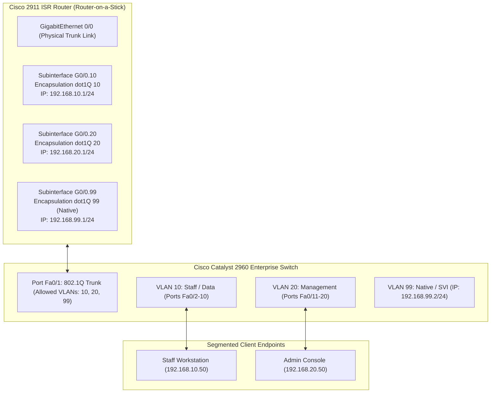

# Cisco Networking & Deep Packet Analysis

**Primary Focus:** Cisco IOS Configuration, 802.1Q VLANs, Inter-VLAN Routing, IPv4/IPv6 Dual-Stack, Wireshark Packet Forensics  
**Source Repositories:** [CSIA-210 Network Protocol Analysis](https://github.com/jkosber/CSIA-210-Network-Protocol-Analysis) • [Networking-109](https://github.com/jkosber/Networking-109)  

---

## 1. Objective

To master enterprise networking fundamentals across Cisco hardware and Packet Tracer simulations, and pair that configuration knowledge with deep packet inspection using **Wireshark** and **tcpdump** to analyze protocol behavior at the byte and frame level.

---

## 2. Network Architecture & Inter-VLAN Routing



---

## 3. Cisco IOS Configuration Highlights

### A. 802.1Q Trunking & Switchport Security
```cisco
! Switchport Hardening & 802.1Q Trunk Setup
Switch(config)# vlan 10
Switch(config-vlan)# name DATA_STAFF
Switch(config)# vlan 20
Switch(config-vlan)# name MANAGEMENT
Switch(config)# vlan 99
Switch(config-vlan)# name NATIVE_MGMT

Switch(config)# interface FastEthernet 0/1
Switch(config-if)# switchport mode trunk
Switch(config-if)# switchport trunk native vlan 99
Switch(config-if)# switchport trunk allowed vlan 10,20,99

Switch(config)# interface range FastEthernet 0/2 - 10
Switch(config-if-range)# switchport mode access
Switch(config-if-range)# switchport access vlan 10
Switch(config-if-range)# switchport port-security
Switch(config-if-range)# switchport port-security maximum 2
Switch(config-if-range)# switchport port-security violation restrict
Switch(config-if-range)# switchport port-security mac-address sticky
```

### B. Router-on-a-Stick Subinterface Configuration
```cisco
! Inter-VLAN Routing on Cisco ISR
Router(config)# interface GigabitEthernet 0/0
Router(config-if)# no ip address
Router(config-if)# no shutdown

Router(config)# interface GigabitEthernet 0/0.10
Router(config-subif)# encapsulation dot1Q 10
Router(config-subif)# ip address 192.168.10.1 255.255.255.0

Router(config)# interface GigabitEthernet 0/0.20
Router(config-subif)# encapsulation dot1Q 20
Router(config-subif)# ip address 192.168.20.1 255.255.255.0

Router(config)# interface GigabitEthernet 0/0.99
Router(config-subif)# encapsulation dot1Q 99 native
Router(config-subif)# ip address 192.168.99.1 255.255.255.0
```

---

## 4. Deep Packet Analysis with Wireshark & tcpdump

Granular packet dissection was performed across multiple protocol capture sessions:

### A. TCP 3-Way Handshake & Teardown Dynamics
* **SYN Frame:** Verified Initial Sequence Number (ISN) random generation, Maximum Segment Size (MSS) option negotiation, and TCP Window Scale factor.
* **SYN-ACK Frame:** Validated acknowledgment sequence calculation (Ack = client ISN + 1).
* **Connection Teardown:** Analyzed graceful four-way `FIN`/`ACK` teardowns versus abrupt connection resets (`RST` flag) caused by closed destination ports.

The handshake is SYN -> SYN-ACK -> ACK; data exchange follows, then a graceful four-way FIN/ACK teardown (or RST on closed ports).


### B. IPv4 vs. IPv6 Address Resolution
* **IPv4 Address Resolution:** Analyzed broadcast `ARP Request` (`Who has 192.168.10.1? Tell 192.168.10.50`) and unicast `ARP Reply` frames to observe MAC table population.
* **IPv6 Neighbor Discovery Protocol (NDP):** Replaced broadcast ARP with ICMPv6 **Neighbor Solicitation (NS)** sent to solicited-node multicast addresses (`ff02::1:ffxx:xxxx`) and **Neighbor Advertisement (NA)** unicast replies.
* **SLAAC vs. DHCPv6:** Analyzed ICMPv6 Router Solicitation (RS) and Router Advertisement (RA) messages verifying prefix assignment, M-flag (Managed Address Configuration), and O-flag (Other Configuration).

---

## 5. Troubleshooting Scenarios

??? example "Scenario: Native VLAN Mismatch on 802.1Q Trunk"
    * **Symptom:** Cisco CDP generated continuous `%CDP-4-NATIVE_VLAN_MISMATCH` alerts between Switch 1 and Switch 2, causing inter-switch management connectivity loss.
    * **Wireshark Analysis:** Captured 802.1Q tagged frames and observed that untagged management frames originating on VLAN 1 were being injected into VLAN 99 on the opposite switch.
    * **Resolution:** Reconfigured trunk ports on both ends with `switchport trunk native vlan 99`, aligning native encapsulation and restoring consistent STP / CDP forwarding.

