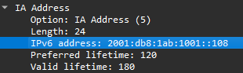

# IPv6 packet investigations

A Windows host can have an IPv6 address and still fail to reach another network. In my **CSIA 210** final capstone, I used supplied traces and host output to investigate address assignment, duplicate addresses, source-address changes and loss of a default router.

The work connected fields inside DHCPv6 and ICMPv6 packets to the symptoms shown by the hosts. My contribution was filtering the traffic, identifying relevant frames, comparing them with host configuration and documenting the conclusions. I did not build or repair the supplied network during this analysis.

**Historical evidence:** final-capstone submission with screenshots dated May 12, 2026. Packet numbers belong to the two course traces. The original capstone PCAPs are missing from the repository, so the account below relies on the preserved answers and screenshots; the traffic has not been replayed for this page.

## Environment and analysis method

The screenshots show `capstone-labs-3-trace-file.pcapng` and `capstone-labs-4-trace-file.pcapng` in Wireshark. The scenarios include Windows hosts, DHCPv6 exchanges, a layer-3 device sending Router Advertisements, and destinations outside the hosts' local IPv6 network. IPv4 remains available in the dual-stack examples.

I used display filters to reduce each trace, expanded the relevant protocol fields, and compared those values with the supplied `ipconfig` output. The IPv6 addresses shown here use the course's `2001:db8::/32` documentation prefix; they are not addresses from my own network.

| Filter used in the submission | Purpose |
|---|---|
| `dhcpv6.msgtype == 7` | Show DHCPv6 Reply messages when looking for the assigned address. |
| `dhcpv6.iaaddr.ip == 2001:db8:1ab:1001::108` | Match the IA Address value being correlated with the Windows host. |
| `icmpv6.type == 134` | Isolate Router Advertisements and inspect their flags, prefixes and router lifetime. |
| `ipv6` | Follow the broader IPv6 sequence, including address changes and neighbor discovery. |

## Finding the DHCPv6 address assignment

The first question was which reply supplied the address visible on the Windows 10 host. I filtered for DHCPv6 replies, inspected their IA Address options and recorded **frame 9306** as the first matching reply for the address ending in `::108`.

The original Wireshark screenshot records the fields below. The crop shows the expanded **IA Address** option: notice the address ending in `::108` and its separate preferred and valid lifetimes.

<figure class="evidence-figure">
  

    
  

  <figcaption>Historical capture from the May 12, 2026 submission, cropped to the IA Address fields of selected frame 9306. The frame number, Reply type and UDP ports are visible in the original screenshot, outside this crop. <a href="../../assets/evidence/networking/dhcpv6-address-lifetimes-2026-05-12.png">Open the full-size crop</a>. Scroll horizontally to inspect the image.</figcaption>
</figure>

| Frame 9306 field | Recorded value | Interpretation |
|---|---|---|
| Message type | Reply, type 7 | The server's response in the DHCPv6 exchange. |
| UDP ports | Source 547, destination 546 | Server-to-client direction for this reply. |
| Address option | IA Address, option 5 | The assigned address is inside an option, distinct from the packet's destination address. |
| IPv6 address | `2001:db8:1ab:1001::108` | Value matched to the host configuration in my written analysis. |
| Preferred / valid lifetime | 120 / 180 seconds | The two lifetimes recorded for this address. |

Earlier replies visible in the original screenshot carry an address ending in `::109`, so checking only the message type would not establish the match. The IA Address field was the useful link to the host output.

The host-address match comes from my written `ipconfig` comparison; that section of the submission does not include the corresponding host-output image.

## Separating a duplicate address from general connectivity

In the second trace, my analysis followed two Windows hosts using the same target address, ending in `::117`. The answers compare their different source MAC addresses with neighbor-discovery information and the Windows output marking the address as duplicate.

The reported connectivity result was mixed: an ordinary ping used IPv4 and received two replies, while the forced IPv6 attempt failed. The submission also records a name-resolution error on that forced attempt, so that error alone would not establish the cause. The duplicate-address indication and neighbor-discovery comparison provide the additional evidence for the address conflict.

The record ends with the diagnosis; no address correction or successful IPv6 retest is recorded.

## Tracking source-address changes

A separate sequence followed the Windows 10 host as it acquired public and temporary SLAAC addresses alongside its DHCPv6 address. My answers record:

| Point in the sequence | Historical observation |
|---|---|
| Router Advertisement analysis | Managed configuration enabled; on-link and autonomous prefix flags set. |
| Frame 6913 | The host used its temporary SLAAC address as the source. |
| Frame 7512 | A later advertisement was recorded with the autonomous flag unset. |
| Subsequent host output | Both SLAAC addresses were reported as deprecated; a later packet used the DHCPv6 address ending in `::117`. |

The original explanation attributed deprecation directly to the autonomous flag becoming zero. That is too strong. For SLAAC processing, an unset autonomous flag makes the host ignore that Prefix Information option; an address becomes deprecated when its preferred lifetime expires. The original capture and full lifetime sequence would be needed to establish the precise timing here. [RFC 4862, Router Advertisement processing and lifetime expiry](https://www.rfc-editor.org/rfc/rfc4862.html#section-5.5.3).

The later address-state changes and frame references come from my written answers. This section's screenshot shows only the start of the trace.

## Losing the gateway while retaining the address

The final investigation separated address assignment from default-router state. The Windows host initially had a preferred IPv6 address and an IPv6 gateway. A later host-output check retained the address but no longer listed the IPv6 gateway, and traffic to an off-link destination failed.

I filtered Router Advertisements and compared their router lifetimes with the host's behavior. The written submission records this sequence:

| Evidence point | Recorded state or result |
|---|---|
| Initial Router Advertisement | Router lifetime 270 seconds. The embedded screenshot directly shows this value in frame 1. |
| Frame 9660 | First packet in the earlier group of four pings. |
| Frame 9725 | Router Advertisement with lifetime 0; the host subsequently lacked its IPv6 default gateway. |
| Host configuration check | IPv6 address remained preferred; only the IPv4 default gateway was listed. |
| Frame 9887 | Later Router Advertisement restored a 270-second router lifetime. |
| Frame 9991 | First packet in the later ping group; the written summary records restored connectivity. |

The diagnosis is consistent with Router Advertisement processing: receiving a lifetime of zero for an existing default-router entry removes that entry. A later advertisement with a nonzero lifetime can restore it. This is separate from the DHCPv6 address lease; the lease itself did not supply the default gateway. [RFC 4861, processing received Router Advertisements](https://www.rfc-editor.org/rfc/rfc4861.html#section-6.3.4).

The screenshot shows the initial 270-second lifetime. The zero-lifetime advertisement, recovery frame and ping outcome come from the written answers.

## What remained visible in encrypted traffic

The same capstone examined SSH and HTTPS. My answers reference SSH frames 27218 and 27364, and HTTPS frames 27902 and 29910. The SSH screenshot shows readable protocol banners, key exchange and subsequent packets identified as encrypted.

Application content was unreadable in the inspected traffic, while connection information and parts of setup remained visible. Neither session was decrypted.

## Sources and scope

The [final capstone submission](https://github.com/jkosber/CSIA-210-Network-Protocol-Analysis/blob/main/Module08/CSIA%20210%20Finals%20Capstone%20submission%20file%20-%20Jadon%20Kosberg.docx) contains the answers and screenshots for Capstone Labs 3 and 4. The original document is preserved, including explanations qualified above.

The [protocol-analysis repository](https://github.com/jkosber/CSIA-210-Network-Protocol-Analysis) contains other coursework and a separate introductory capture. Verifying the later frame references and reconstructing the SLAAC lifetime sequence would require the missing capstone traces and corresponding host output.

[Networking and packet analysis overview](cisco-networking-analysis.md) · [CyberOps traffic investigation](soc-threat-detection.md) · [All projects](index.md)
