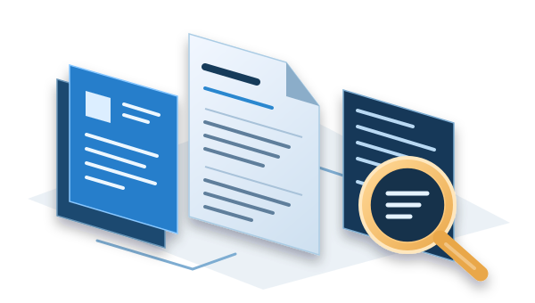

# Job scan and resume tailor

A job-search tool built around my resume, with instructions for reviewing postings and scripts for preparing and checking documents.

## Purpose

The goal was to keep job searches and tailored resumes organized. The wording of a resume can change for a role, but the employment history and experience need to stay accurate.

The project combines workflow instructions with Python and JavaScript utilities. Its outputs include ranked job matches, one-page resumes and a local review page.

## Workflow

<figure class="case-visual">
  
  <figcaption>The workflow moves from reviewing postings to preparing and reviewing documents.</figcaption>
</figure>

1. **Review job postings.** The workflow guides collection of openings and comparison of their requirements with my resume.
2. **Prepare the resume content.** A structured specification supplies the text, with checks for required facts and prohibited terms.
3. **Build the documents.** Python creates DOCX files, and LibreOffice converts them to PDF. A separate script builds the ranked-matches report.
4. **Review the results.** Checks cover required content, document structure, page count, layout and wording. An HTML page collects the documents for review.

## Implementation

The document builder checks for specific required facts and rejects listed terms that should not appear. It also checks the layout and enforces a one-page PDF. JavaScript utilities check the wording.

Those checks catch known problems; each resume still needs review for accuracy and fit. The repository includes regression tests for resume generation, ranking documents, the viewer and wording checks.

## Status

The project is complete and maintained as needed. The repository stays private because it contains personal resume material and job-search records.

## Related work

[All projects](index.md) · [Professional experience](../experience/index.md)
