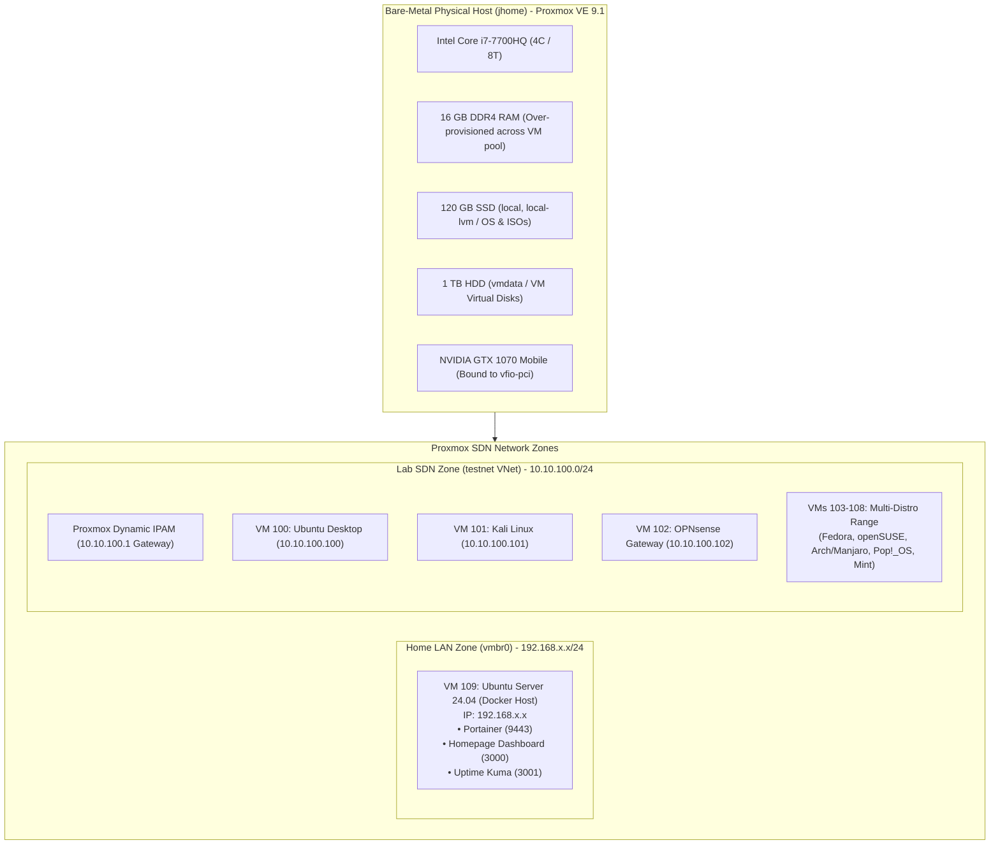
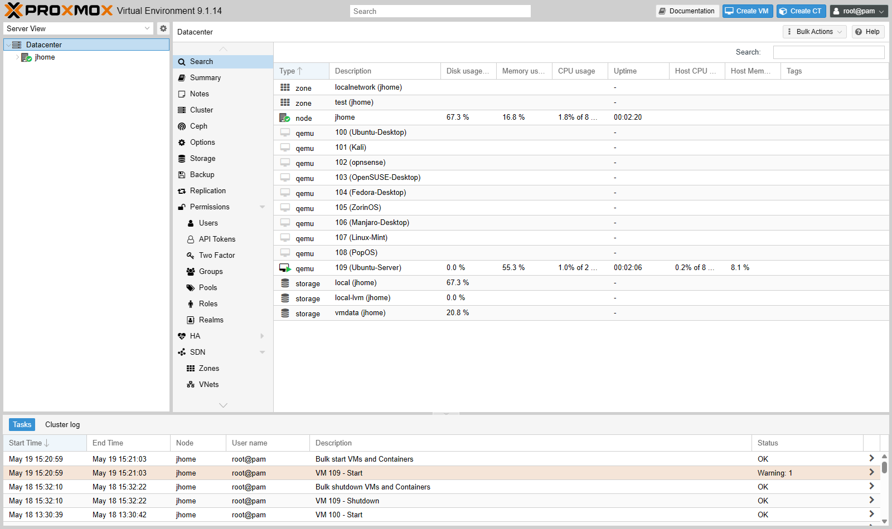

# Proxmox Virtualization & Software-Defined Networking

**Primary Focus:** Bare-Metal Hypervisor Administration, SDN Segmentation, Docker Service Stack, VFIO GPU Passthrough  
**Source Repository:** [github.com/jkosber/JHomelab](https://github.com/jkosber/JHomelab)

---

## 1. Objective

To build and run a Proxmox homelab on an Alienware 15 R3. The primary architectural goals were:

1. Provide complete network isolation between the home LAN and experimental testing virtual machines using **Software-Defined Networking (SDN)**.
2. Implement predictable **IP Address Management (IPAM)** and datacenter-level firewall access control lists (ACLs).
3. Host always-on core infrastructure services (Docker/Portainer, Homepage dashboard, Uptime Kuma) with minimal resource overhead.
4. Configure hardware PCI passthrough (**VFIO / IOMMU**) to dedicate a discrete GPU to specific virtual workloads.

---

## 2. Architecture & Topology

The hypervisor runs on an Alienware 15 R3 platform running **Proxmox VE 9.1.0 (Kernel 6.17)**.



---

## 3. Technologies & Specifications

| Component                | Technical Specification                                                  | Operational Role                                                         |
| :----------------------- | :----------------------------------------------------------------------- | :----------------------------------------------------------------------- |
| **Hypervisor**           | Proxmox VE 9.1.0 (Linux Kernel 6.17)                                     | Bare-metal type-1 hypervisor                                             |
| **Host CPU & RAM**       | Intel i7-7700HQ (4C / 8T), 16 GB DDR4                                    | Core compute with dynamic RAM commitment                                 |
| **Storage Architecture** | Tier 1: 120 GB SSD (`local`, `local-lvm`)<br>Tier 2: 1 TB HDD (`vmdata`) | Tier 1 for PVE root OS and ISOs;<br>Tier 2 for VM `.qcow2` virtual disks |
| **Discrete GPU**         | NVIDIA GeForce GTX 1070 Mobile                                           | Bound to `vfio-pci` driver via IOMMU isolation                           |
| **SDN Framework**        | Proxmox SDN (Simple Zone + EVPN capable)                                 | Virtual Network (`testnet`) with managed IPAM                            |
| **Container Engine**     | Docker Engine + Portainer on VM 109                                      | Microservice container host                                              |

---

## 4. Implementation & Configuration

### A. Software-Defined Networking & Predictable Addressing

To isolate experimental operating systems (including penetration testing distros like Kali) from production home network traffic, a dedicated Proxmox SDN zone was created:

- **Home Network (`vmbr0`):** `192.168.x.x/24` — Management IP on management subnet (`192.168.x.x:8006`) and always-on infrastructure (`192.168.x.x`).
- **Lab SDN (`testnet`):** `10.10.100.0/24` — Fully isolated virtual switch managed by Proxmox IPAM with local DHCP serving the `10.10.100.1` gateway.
- **Predictable Addressing Rule:** IPs follow `10.10.100.<VMID>` (VM 101 → `10.10.100.101`, VM 105 → `10.10.100.105`). This simplifies correlation across firewall logs, packet captures, and hypervisor inventories.

### B. Datacenter Firewall Rule Base

A strict default-drop policy was applied at the Proxmox Datacenter level with the following rules:

1. **Management ACL:** Allows ICMP Ping, SSH (Port 22), and Proxmox Web UI (Port 8006) exclusively from authorized management subnets.
2. **SDN Egress:** Permits outbound DNS (UDP/TCP 53) and DHCP (UDP 67/68) within the `testnet` zone.
3. **Internet Egress:** Permits outbound HTTP/HTTPS for package repository updates while blocking any unsolicited inter-zone inbound connections to the home LAN.

```
+-----------------------------------------------------------------------------------+
| Proxmox Datacenter Firewall Rules                                                 |
+-----+--------+---------------+------------------+-------+----------+--------------+
| Dir | Action | Source        | Destination      | Proto | DPort    | Comment      |
+-----+--------+---------------+------------------+-------+----------+--------------+
| IN  | ACCEPT | MgmtSubnet    | 192.168.x.x      | tcp   | 8006, 22 | PVE Web/SSH  |
| IN  | ACCEPT | MgmtSubnet    | 192.168.x.x      | icmp  | -        | Mgmt Ping    |
| OUT | ACCEPT | 10.10.100.0/24| 10.10.100.1      | udp   | 53, 67   | In-Zone DNS  |
| OUT | ACCEPT | 10.10.100.0/24| 0.0.0.0/0        | tcp   | 80, 443  | HTTP/S Egress|
+-----+--------+---------------+------------------+-------+----------+--------------+
```

### C. Container Service Stack on VM 109

VM 109 (`Ubuntu-Server` @ `192.168.x.x`) is configured as the sole auto-booting guest, running lightweight Docker containers managed via Portainer:

- **Homepage (Port 3000):** Dashboard for internal lab links.
- **Uptime Kuma (Port 3001):** Active HTTP/ICMP health checks monitoring hypervisor and VM uptime.
- **Portainer (Port 9443):** Web interface for container image lifecycle and volume management.

---

## 5. Validation & Evidence

The lab environment was validated through live operational status:


_Proxmox Datacenter inventory displaying the active node `jhome`, storage pools, and VMs 100 through 109._


_Active Datacenter-level firewall rulebase enforcing access control and egress permissions._


_Node `jhome` hardware summary (CPU, memory, and storage configuration)._

---

## 6. Troubleshooting & Engineering Challenges

??? example "Issue: IOMMU Grouping Conflicts on Mobile GPU" * **Problem:** When attempting to pass through the NVIDIA GTX 1070 Mobile to a guest VM, Proxmox reported that the GPU shared an IOMMU group with the PCIe root port and onboard audio controller, preventing clean PCI attachment. * **Root Cause:** Laptop motherboard PCIe root topologies frequently bundle multi-function PCIe devices into unified IOMMU groups. * **Remediation:** Added `pcie_acs_override=downstream,multifunction` to `/etc/default/grub`, reloaded GRUB (`update-grub`), and verified discrete IOMMU grouping via `pvesh get /nodes/jhome/hardware/pci`. The GPU was then successfully bound to the `vfio-pci` stub driver.

??? example "Issue: Memory Over-Commitment Strategy" * **Problem:** Allocating maximum required RAM to all 10 VMs simultaneously would require ~48 GB, exceeding the physical 16 GB capacity. * **Resolution:** Only VM 109 (2 GB) is set to auto-boot. Desktop-heavy VMs (Fedora, Kali, Zorin) are powered on individually on-demand, keeping active RAM within safe limits (< 80%).
