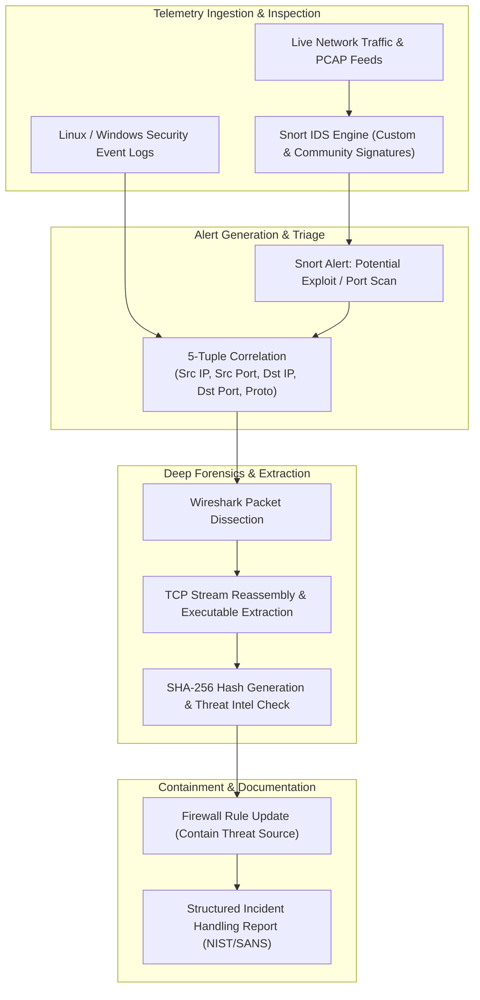

# SOC Threat Detection & Snort IDS Analysis

**Primary Focus:** Cisco CyberOps Associate Track, Snort IDS Signature Authoring, 5-Tuple Incident Triage, PCAP Payload Extraction  
**Source Repository:** [github.com/jkosber/CyberOps-115](https://github.com/jkosber/CyberOps-115)  

---

## 1. Objective

To execute cybersecurity operations workflows aligned with the **Cisco CyberOps Associate** certification track, focusing on intrusion detection system (**Snort IDS**) rule authoring, alert triage, malware payload extraction from network captures, and structured incident response.

---

## 2. Security Operations Incident Workflow



---

## 3. Technical Implementation & Snort Rule Authoring

### A. Custom Snort IDS Detection Rules
Crafted custom Snort detection rules to identify malicious indicators of compromise (IoCs):

```snort
# Detect unauthorized ICMP sweeps across internal subnets
alert icmp any any -> 192.168.0.0/24 any (msg:"SECURITY ALERT: ICMP Echo Sweep Detected"; itype:8; threshold:type both, track by_src, count 10, seconds 5; sid:1000001; rev:1;)

# Detect sensitive plaintext credential transmission over HTTP POST
alert tcp any any -> $HTTP_SERVERS 80 (msg:"SECURITY ALERT: Sensitive Credential Submission via Plaintext HTTP"; flow:to_server,established; content:"POST"; http_method; content:"password="; nocase; sid:1000002; rev:1;)

# Detect suspicious executable download in transit
alert tcp $EXTERNAL_NET 80 -> $HOME_NET any (msg:"SECURITY ALERT: Windows Executable File Download Detected"; flow:to_client,established; content:"MZ"; offset:0; depth:2; sid:1000003; rev:1;)
```

### B. 5-Tuple Forensic Isolation & Payload Extraction
During incident response exercises, identified compromised hosts by correlating the standard **5-tuple**:
1. **Source IP Address** (`10.0.2.15`)
2. **Source Port** (`49152`)
3. **Destination IP Address** (`198.51.100.23`)
4. **Destination Port** (`80`)
5. **Transport Protocol** (`TCP`)

**Payload Extraction Workflow:**
1. Filtered the packet capture in Wireshark on the suspect TCP conversation stream.
2. Reassembled the raw TCP stream to isolate the HTTP payload.
3. Extracted the binary artifact (`.exe`) directly from Wireshark's *Export Objects* interface.
4. Generated cryptographic hashes (`sha256sum artifact.exe`) to confirm payload integrity and compare against threat intelligence repositories.

---

## 4. Incident Response & Threat Mitigation

Followed standardized **NIST SP 800-61 / SANS** incident response phases:
* **Preparation:** Tuning IDS signatures to suppress false positives while maintaining high sensitivity.
* **Detection & Analysis:** Correlating Snort alert timestamps with web server access logs.
* **Containment:** Implementing immediate firewall drop rules targeting malicious external IP addresses.
* **Eradication & Recovery:** Validating that compromised test nodes were sanitized and restored to known-clean baselines.
* **Post-Incident Review:** Documenting findings in the official **CyberOps Skills Exam Report**.

---

## 5. Production & Enterprise Relevance

* **SOC Analyst Readiness:** Direct experience working with the foundational tools of modern security operations centers (Snort, Wireshark, Syslog, Nmap).
* **Signal vs. Noise Discrimination:** Understanding how to tune IDS alert thresholds prevents analyst alert fatigue in high-throughput enterprise networks.
